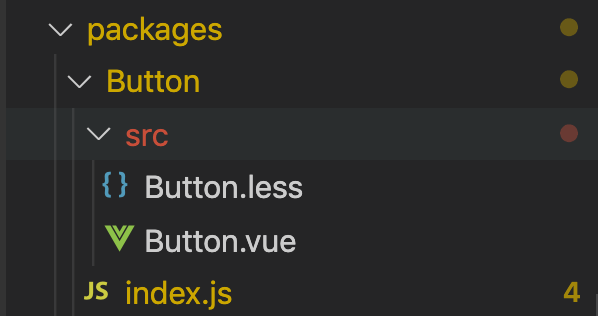

#### 替换icon图标
1. 在iconFont[https://www.iconfont.cn/?spm=a313x.7781069.1998910419.d4d0a486a]中选择echo-ui项目下的所有图标，下载文件
2. 进入echoui项目找到lib>theme-chalk>fonts文件将对应的文件替换成新文件。
3. 将下载的css文件内容更改名字index.css替换掉lib>theme-chalk>index.css
4. 进入到index.css将@font-face中url改为fonts/iconfont
5. 进入到index.css将.iconfont
```
[class^="echo-icon-"],
[class*=" echo-icon-"]
```
6. 将所有图标的命名改为例如

```
.echo-icon-spinner2
```


#### 新增组件
1. 在packages下新建组件文件，例如
2. 在packages>index.js中抛出组件。
例如：
```
import EchoButton from './Button';

// 存储组件列表
const components = [
  EchoButton
]
```
3. 在App.vue中使用新增组件。

#### npm 发布组件库
1. 修改版本：
  进入package.json中修改 "version": "0.0.0",
2. 库打包
  执行命令
```
$ npm run lib
```
3. 发布组件库

```
// 登录
$ npm login
// 发布
$ npm publish
```

#### npm 提交代码+ 更新文档

1. 打包代码（目的更新组件库文档）
```
$ npm run build
```
2. 提交代码


### 基于vue-cli3在github上发布github pages的一些配置
 在项目的vue.config.js中增加代码

 ```
 module.exports = {
  publicPath: './',
 }
 ```

 #### 编辑组件库文档
* 基础组件中文档编写
 在examples中编辑文档
###### 基础组件相关
3. 在views>content>assets>componentList.js中配置左侧导航栏及markdown和引用组件。
1. 在examples>demos中引用组件，在demos>index.js中注册组件；
2. 在static>posts>components中 写markdown 文档 & index.js中注册组件；


